# National Civil Registry Enterprise Network – Zambia

A multi-site enterprise network simulation for a national civil registry, designed and validated in Cisco Packet Tracer. This project was completed as the NTI **CCNA final project**, under the supervision of **Eng. Abdelrahman Soliman**.


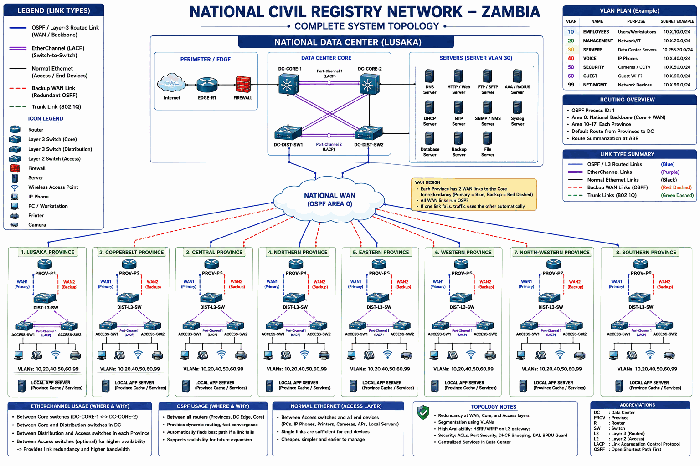

---

## Overview

The scenario modeled here is a **national civil registry** — the government entity that records civil-status events (births, marriages, deaths) and maintains identity records for the population. Its operations depend on network access to a central set of registry applications, and those services must remain available to government staff in every province of the country.

This project presents the enterprise network designed to carry those operations across **Zambia**: a **WAN backbone** that connects a **central datacenter** to **eight provincial offices**, with voice, guest connectivity, wireless access, and centralized security. Everything was built and tested in **Cisco Packet Tracer** — not merely drawn on paper — and the simulation file is included in this repository.

## Network at a Glance

- **Multi-site enterprise architecture** — a single WAN interconnecting all sites
- **Central datacenter** — hosts the enterprise servers and services (Area 0)
- **8 simulated provincial offices** — each with its own OSPF area and campus design
- **Hierarchical IP addressing** — RFC 1918 `10.0.0.0/8` carved into one `/16` per province
- **Multi-area OSPF** — Area 0 backbone with per-province areas and ABRs
- **VLAN segmentation** — employee / guest / servers / voice / management networks
- **Redundant switching & routing** — dual WAN cores, STP primary/secondary, EtherChannel, HSRP
- **Enterprise services** — DHCP, DNS, HTTP, FTP, VoIP (CME), WLAN, Syslog, SNMP, AAA
- **Security controls** — ACLs, Port Security, BPDU Guard, DHCP Snooping, DAI
- **Cisco Packet Tracer implementation** — fully simulated and verified

## Architecture

The network is organized in three tiers:

| Tier | Role |
|---|---|
| **WAN backbone (Area 0)** | Dual WAN core routers carry inter-site traffic; the datacenter and the internet edge attach here |
| **Datacenter (Area 0)** | Redundant datacenter cores (DCC1 / DCC2) front the server farm and host enterprise services |
| **Provincial sites (Areas 10–80)** | Each province is a self-contained campus with its own OSPF area, connected to the backbone through its edge router |

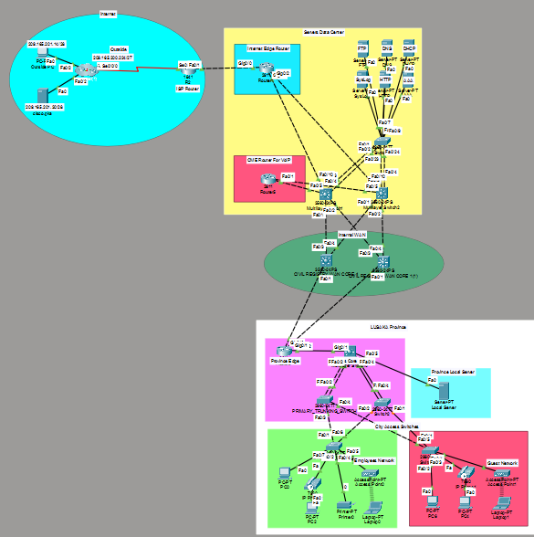

The internet edge provides the network with external connectivity through the ISP, while all internal reachability is carried over the OSPF backbone.

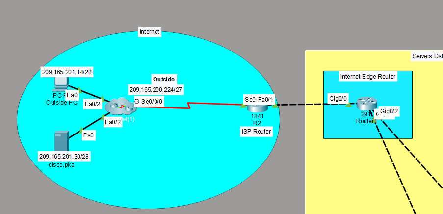

## Routing Design

OSPF is used as the single interior routing protocol:

- **Area 0** forms the backbone: the WAN links, the WAN core routers, and the datacenter.
- Each province is assigned its **own area** (Area 10 for Lusaka, Areas 20–80 for provinces 2–8).
- The **edge router of each province acts as an Area Border Router (ABR)**, maintaining the Area 0 adjacency toward the core while serving the local province area. Inter-area traffic is summarized through the backbone.

Keeping each province in its own area confines internal routing changes to that area. An SPF calculation in one province does not ripple across the rest of the network, and the backbone stays stable and predictable.

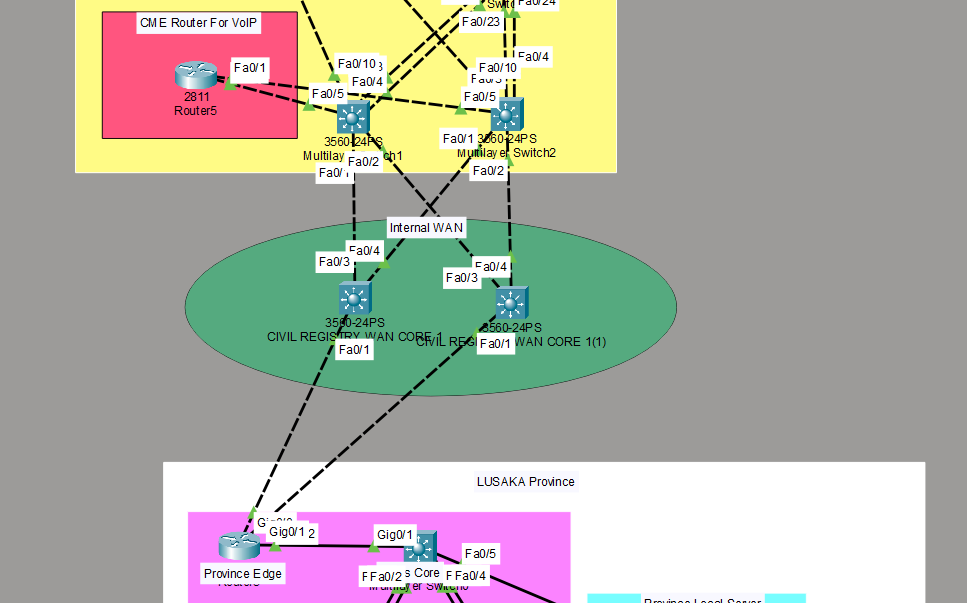

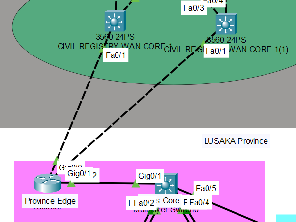

## IP Addressing & VLAN Design

The whole design is allocated from the private RFC 1918 block `10.0.0.0/8`:

- `10.255.0.0/16` is reserved for the **WAN and datacenter**.
- Every province receives an entire **/16** (`65,536` addresses, `65,534` usable), giving each province room to grow without renumbering.

| OSPF Area | Site | Network |
|---|---|---|
| 0 | WAN & Datacenter | `10.255.0.0/16` |
| 10 | Province 1 — Lusaka | `10.1.0.0/16` |
| 20 | Province 2 | `10.2.0.0/16` |
| 30 | Province 3 | `10.3.0.0/16` |
| 40 | Province 4 | `10.4.0.0/16` |
| 50 | Province 5 | `10.5.0.0/16` |
| 60 | Province 6 | `10.6.0.0/16` |
| 70 | Province 7 | `10.7.0.0/16` |
| 80 | Province 8 | `10.8.0.0/16` |

The same VLAN structure is used in every province and inside the datacenter (using the `10.255.x.x` block). Subnets are sized to the community they serve:

| VLAN | Purpose | Subnet (per province / DC) | Total Addresses | Usable Hosts |
|---|---|---|---|---|
| 10 | Employees | `10.x.8.0/21` | 2,048 | 2,046 |
| 20 | Guest | `10.x.16.0/22` | 1,024 | 1,022 |
| 30 | Servers | `10.x.30.0/24` | 256 | 254 |
| 40 | Voice | `10.x.40.0/24` | 256 | 254 |
| 50 | Reserved | `10.x.50.0/24` | 256 | 254 |
| 60 | Management | `10.x.60.0/24` | 256 | 254 |
| 99 | Network Management | `10.x.99.0/24` | 256 | 254 |

Subnet math: `/16` → 65,536 total / 65,534 usable, `/21` → 2,048 / 2,046, `/22` → 1,024 / 1,022, `/24` → 256 / 254. (The summary slide in the original presentation contains minor capacity typos, e.g. 65,634 or 255; the values above use the correct host counts.)

The sizing is deliberate: the employee VLAN covers a large staff, the guest VLAN provides generous room for visitor BYOD, servers/voice/management are tightly sized, and the *Reserved* VLAN keeps capacity available for future needs without renumbering.

## Province Architecture

Each province replicates the same campus design. **Lusaka** (Province 1) is documented in detail and acts as the reference topology: an edge router connects the province to the WAN backbone, an L3 core provides inter-VLAN routing, a distribution switch pair (primary / secondary) aggregates access switches, and access switches deliver connectivity per VLAN to employees, guests, IP phones, and wireless clients.

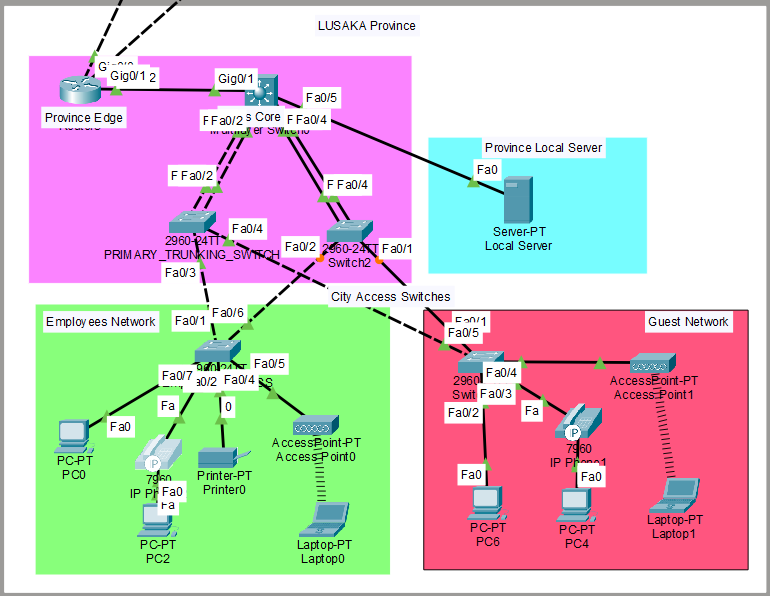

## Layer 2 Design

- **Access switching** separates end devices by role — employees and guests are placed on separate switches and VLANs rather than mixed on a single segment.
- **802.1Q trunking** carries the VLANs between access and distribution switches while keeping traffic isolated end to end.
- **EtherChannel** bundles links between the primary and secondary switches, increasing available bandwidth and providing link-level resilience.
- **Inter-VLAN routing** is performed at the L3 core, so broadcast domains stay small per VLAN.

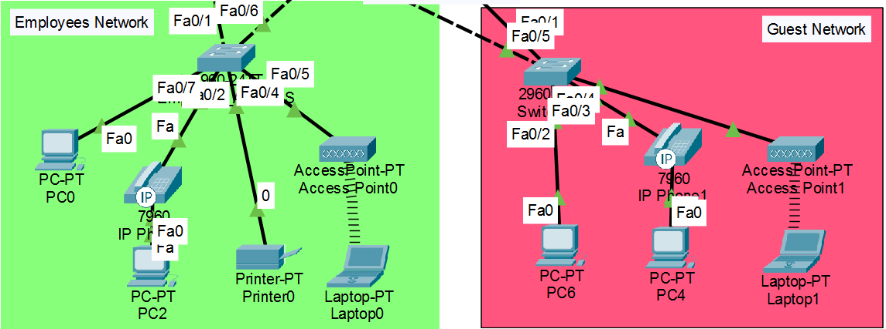

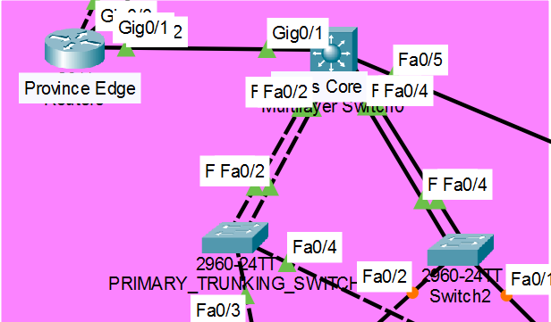

## High Availability & Redundancy

Availability was a first-class design goal, addressed independently at the WAN, switching, and first-hop layers:

| Layer | Mechanism | Purpose |
|---|---|---|
| WAN | Dual WAN core routers | No single point of failure on the backbone; inter-site and DC traffic survives a core failure |
| Switching | Primary / secondary distribution switches with STP roles | Every access segment has a ready alternate L2 path if the primary switch fails |
| Switching | EtherChannel link bundles | Aggregates bandwidth and tolerates individual link loss |
| First hop | HSRP on the datacenter cores (DCC1 / DCC2) | Hosts keep a stable default gateway across a core failover |

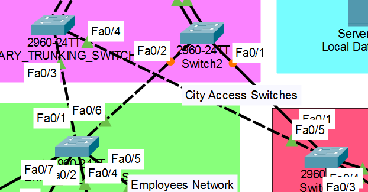

In the datacenter, the two cores present a **virtual default gateway per VLAN** using HSRP. Hosts are configured with one stable gateway IP; the active core forwards, the standby tracks it, and if the active core fails the standby takes over transparently — no host reconfiguration is needed.

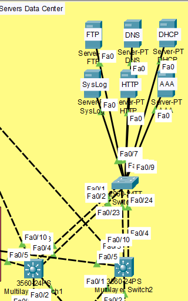

| VLAN | DCC1 | DCC2 | Virtual Gateway |
|---|---|---|---|
| 10 (Employees) | `10.255.8.2` | `10.255.8.3` | `10.255.8.1` |
| 20 (Guest) | `10.255.16.2` | `10.255.16.3` | `10.255.16.1` |
| 30 (Servers) | `10.255.30.2` | `10.255.30.3` | `10.255.30.1` |
| 40 (Voice) | `10.255.40.2` | `10.255.40.3` | `10.255.40.1` |
| 50 (Reserved) | `10.255.50.2` | `10.255.50.3` | `10.255.50.1` |
| 60 (Management) | `10.255.60.2` | `10.255.60.3` | `10.255.60.1` |
| 99 (Network Mgmt) | `10.255.99.2` | `10.255.99.3` | `10.255.99.1` |

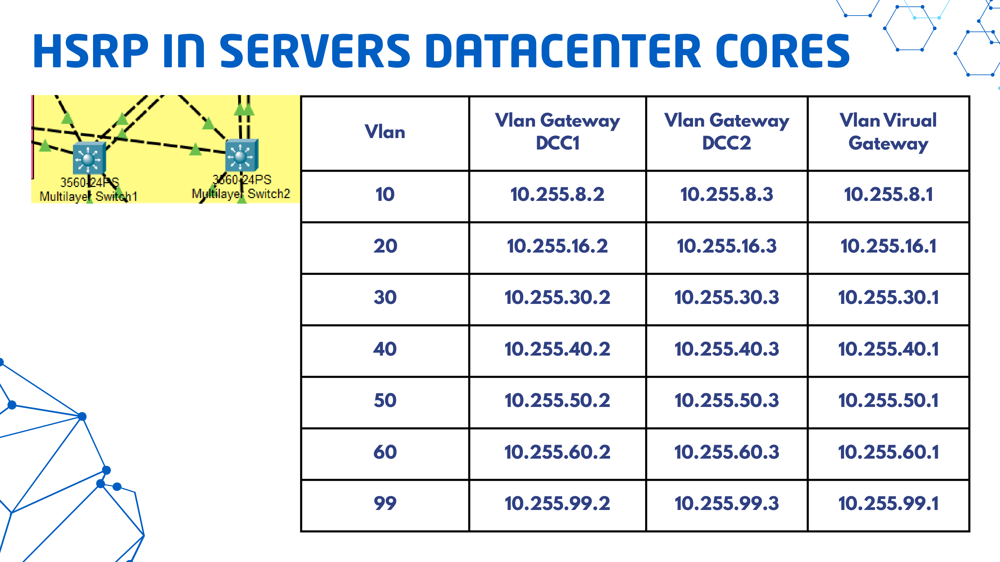

## Network Security

Security is applied as defense-in-depth — at the access edge, on the switching infrastructure, and at the routing layer:

| Control | Where it is applied | What it prevents |
|---|---|---|
| **VLAN segmentation** | Across the whole design | Employee, guest, server, voice, and management traffic are isolated from each other |
| **Extended ACLs (guest restriction)** | Guest network | Guest users can **only** reach the DHCP server (`10.255.30.10`), DNS, and HTTP for web browsing — nothing else on the internal network |
| **Port Security** | Access edge | Limits which devices/MACs can attach to an access port |
| **BPDU Guard** | Access edge | Shuts a port that unexpectedly receives spanning-tree BPDUs, protecting the STP topology from rogue switches |
| **DHCP Snooping / spoofing protection** | Access switching | Blocks rogue DHCP servers from handing out unauthorized addresses |
| **Dynamic ARP Inspection (DAI)** | Access switching | Validates ARP messages against trusted DHCP-snooping bindings, mitigating ARP spoofing |
| **AAA** | Device administration | Centralized authentication of administrators before they can access network devices |

The guest ACL is a good example of the design intent: visitors to a civil-registry office should get **Internet-like access** — assign themselves an address, resolve names, and browse the web — but they must **not** touch registry operations, servers, management VLANs, or provincial peer networks.

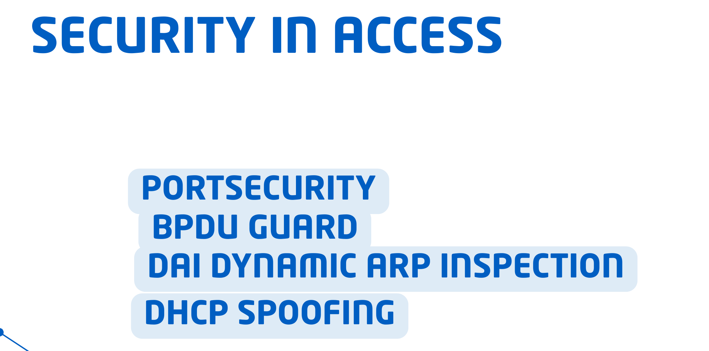

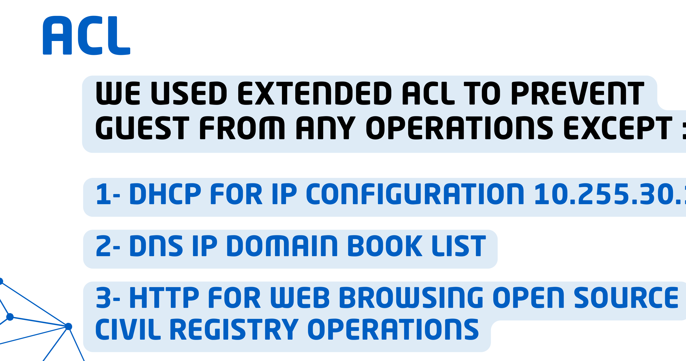

## Enterprise Services

All services are implemented and demonstrated in the simulation:

- **DHCP** — the datacenter DHCP server (`10.255.30.10`) assigns addressing to employees, guests, and wireless clients across the provinces, keeping IP configuration centralized and consistent.
- **DNS** — resolves internal server names so users reach the civil-registry applications by name rather than raw address.
- **HTTP** — the civil-registry web application served from the datacenter and browsed from provincial workstations.
- **FTP** — file transfer service for exchanging records and documents.
- **VoIP (Cisco CME)** — a router acts as Call Manager Express (CME); IP phones in different VLANs register and place calls to each other (demonstrated between a guest and an employee phone).
- **WLAN** — wireless access with stations obtaining their configuration from DHCP.
- **AAA** — central authentication of administrative access, validated on the Lusaka edge router and the Lusaka L3 core.
- **Syslog** — network devices stream logs to a central syslog server for monitoring and troubleshooting.
- **SNMP** — network devices are polled/monitored by an SNMP manager (e.g. `show snmp` on WAN Core 1).

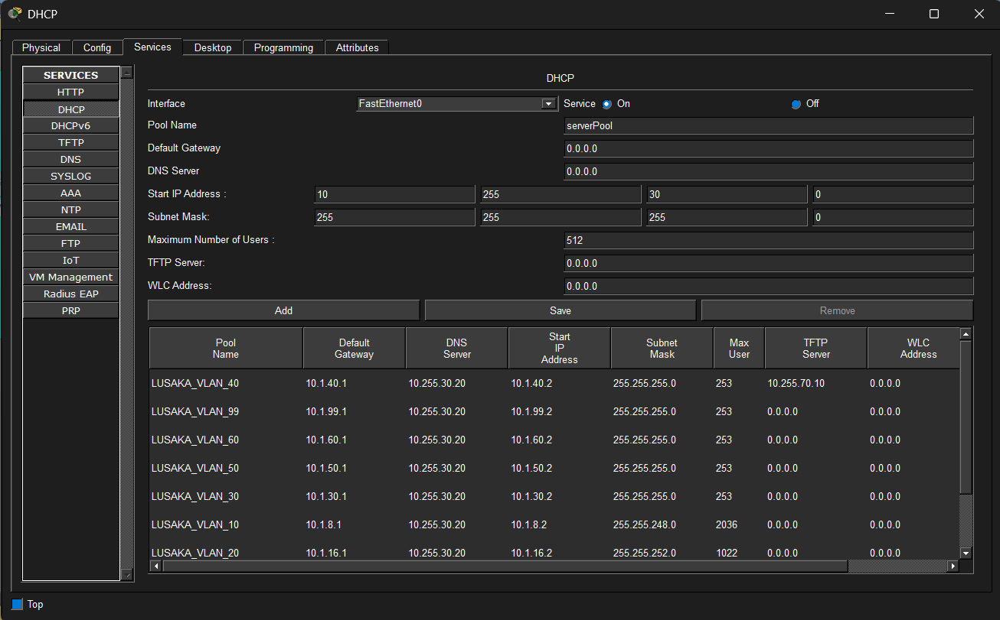

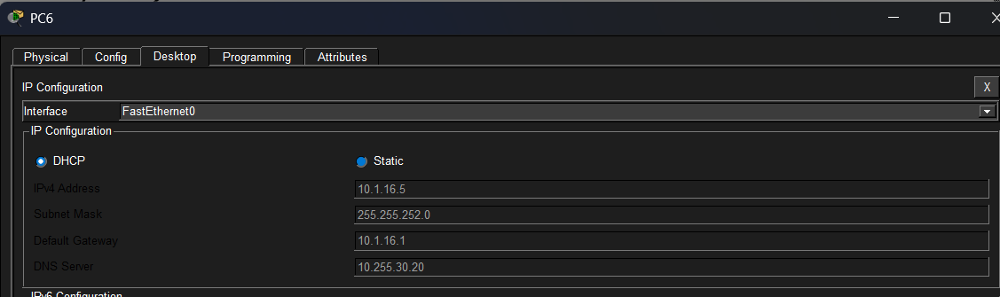

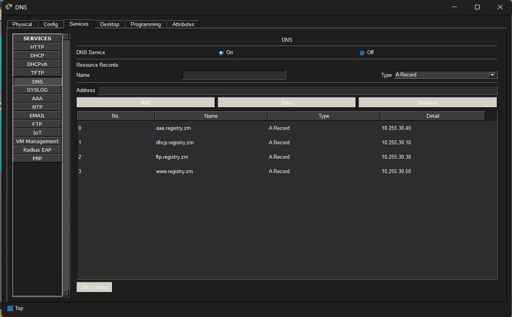

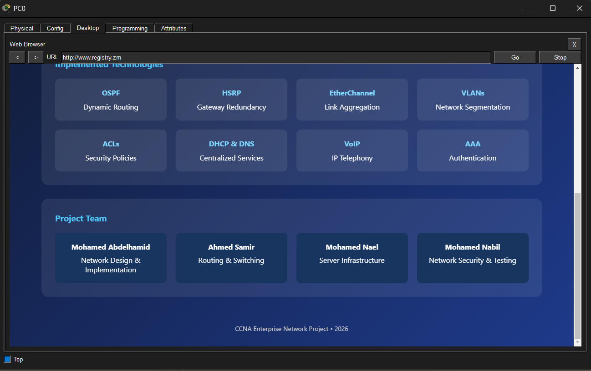

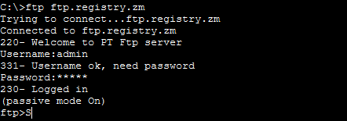

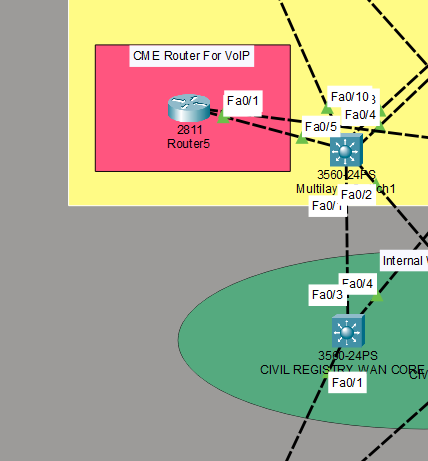

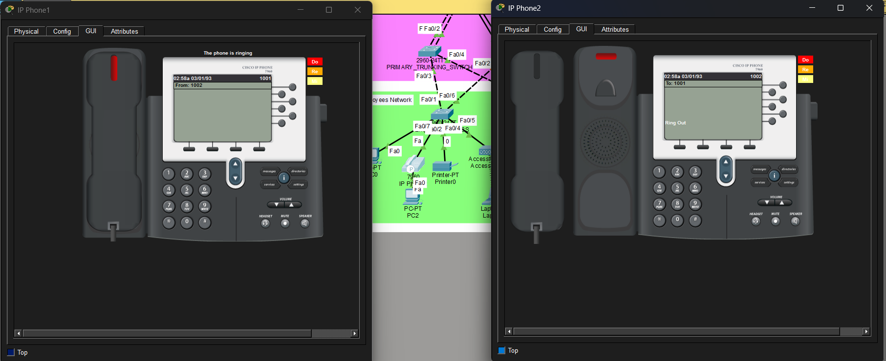

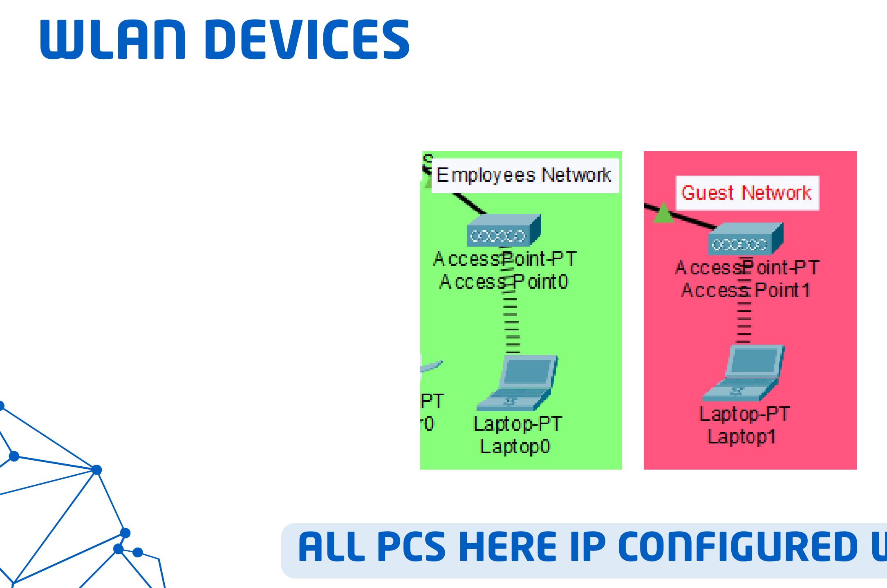

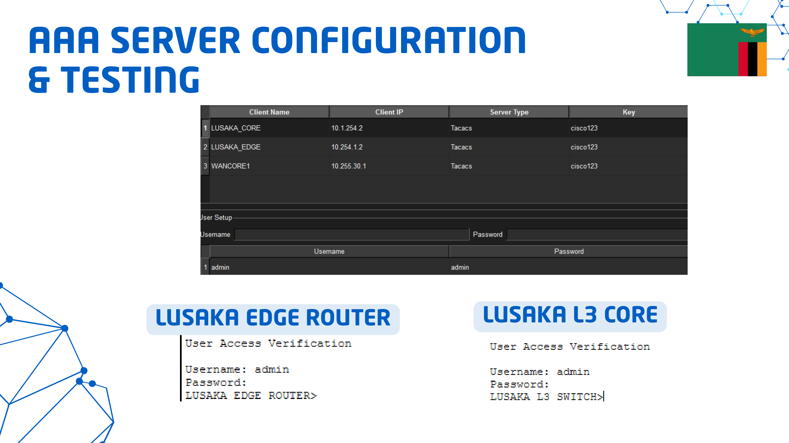

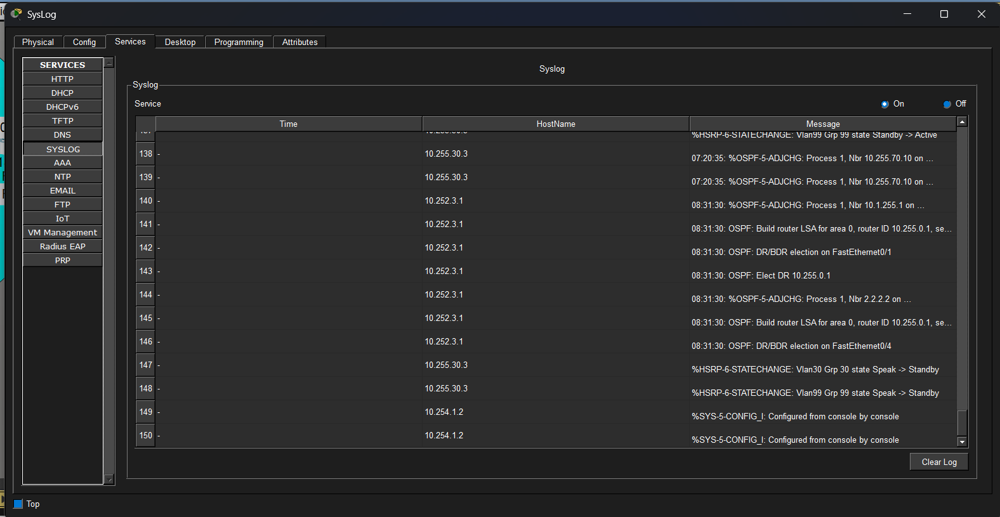

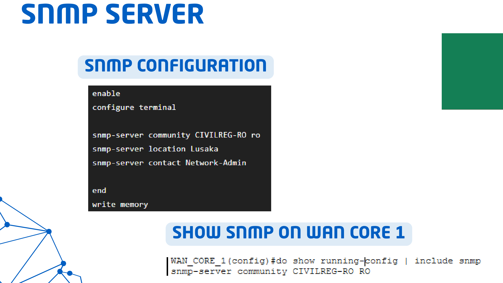

## Testing & Verification

The system was **built and tested in Cisco Packet Tracer** rather than designed on paper only — every functional area was verified with a working test after configuration:

| Area | What was verified |
|---|---|
| DHCP | Clients requested and received usable addresses from the centralized DHCP server |
| HTTP | A workstation browsed the civil-registry web service successfully |
| DNS / FTP | Name resolution and file transfer between clients and the datacenter servers |
| VoIP | An IP phone in the guest VLAN dialed and connected to an employee-phone extension |
| AAA | Administrative access was authenticated through the AAA server on the Lusaka routers |
| Syslog | Device logs were received and stored on the central syslog server |
| SNMP | Network devices were queried by the SNMP manager with `show snmp` output |

| | | |
|---|---|---|
|  |  |  |
|  |  |  |

## Scalability & Design Decisions

- **One `/16` per province** — each province has up to 65,534 usable addresses, so substantial growth (staff, guests, devices) fits inside the current allocation without renumbering or expanding VLAN subnets.
- **OSPF areas per province** — adding a new province means adding one new area; existing areas are unaffected.
- **Reusable campus template** — the Lusaka reference design is replicated across provinces 2–8, which keeps deployment consistent and predictable.
- **Centralized services** — DHCP, DNS, HTTP, FTP, AAA, Syslog and SNMP are concentrated in the datacenter, so all provinces share one administration and one monitoring model.
- **VLAN sizing by community** — large blocks for staff/guest, tight blocks for servers, voice, and management.

## Limitations & Future Improvements

- **Simulation fidelity** — Cisco Packet Tracer validates design and logic, but it does not model every characteristic of physical routers, real WAN circuits, or production-grade security appliances. NAT, firewall, and VPN work was scoped in the project plan but is not demonstrated by the presentation screenshots; a production deployment would complete and harden these.
- **Documentation depth** — Lusaka is presented in full detail; provinces 2–8 reuse the same template and are part of the simulated topology rather than individually documented.
- **Loop-free but not load-shared** — STP provides an alternate path when the primary switch fails, but the secondary path stays unused in steady state. Per-VLAN load balancing, or first-hop redundancy variants that allow both gateways to forward, would use the redundancy more efficiently.
- **WAN redundancy** — the backbone uses dual cores; adding a second WAN link per province (dual-homing) would remove the single uplink dependency at each site edge.
- **Capacity figures** — a few capacity numbers on the original summary slides contain arithmetic typos; this document uses the mathematically correct values, and the same careful review is recommended before cutting real subnets.

## My Contribution

> **Mohamed Abdelhamid — Team Leader**

I led the three-person team behind this project and was personally responsible for the planning and for an assigned share of the implementation on the following scope:

- **Project plan & team leadership** — defined the phases, work breakdown, and integration of the team's output
- **VLAN / IP structure** — designed the hierarchical VLAN and addressing plan used across every province and the datacenter
- **OSPF & ABR configuration** — built the multi-area OSPF design and the Area-Boundary-Router role on the province edge routers
- **VoIP (CME)** — configured the Call Manager Express service and verified telephony between phones
- **HSRP (datacenter cores)** — implemented first-hop redundancy for the server-facing VLANs on DCC1 / DCC2
- **FTP, DHCP, HTTP, Syslog** — configured and tested these datacenter services
- **DHCP spoofing protection** — contributed the anti-rogue-DHCP / DHCP-spoofing protection at the access layer

The complete system — including the areas owned by my teammates — was integrated and validated as a single working environment in Packet Tracer.

## Project Team

| Member | Team focus |
|---|---|
| **Mohamed Abdelhamid** | Team Leader — project plan, VLAN/IP structure, OSPF & ABRs, VoIP, HSRP (datacenter), FTP, DHCP, HTTP, Syslog, DHCP-spoofing protection |
| **Mohamed Nael** | Servers, EtherChannel, NAT, Firewall, DNS, AAA, FTP, DAI |
| **Ahmed Samir** | Switch trunking, access switching, ACLs, inter-VLAN routing, WLAN, SNMP, PortFast / BPDU Guard, VPN |

*Under the supervision of **Eng. Abdelrahman Soliman** — NTI CCNA training.*

## Tools & Technologies

- **Cisco Packet Tracer** — simulation and verification platform
- **IPv4** — RFC 1918 private addressing, CIDR / VLSM
- **OSPF** — multi-area routing, Area 0 backbone, ABRs
- **VLANs & 802.1Q trunking** — segmentation and inter-switch tagging
- **Inter-VLAN routing** — L3 core / SVI design
- **EtherChannel** — link aggregation
- **STP** — spanning tree with PortFast and BPDU Guard
- **HSRP** — first-hop redundancy
- **Port Security, DHCP Snooping, DAI** — access-layer hardening
- **Extended ACLs** — guest-network restriction
- **DHCP, DNS, HTTP, FTP** — datacenter services
- **AAA** — centralized device authentication
- **Syslog & SNMP** — monitoring and logging
- **Cisco CME / VoIP** — IP telephony

## Repository Structure

```
.
├── README.md                          # this document
├── CCNA_Project_Presentation.pdf      # full project presentation (architecture, configs, test results)
├── FinalProjectPacketTracer.pkt       # Cisco Packet Tracer simulation file
└── docs/
    └── images/                        # diagrams & screenshots referenced by this README
```

## How to Open / Run

1. **Install Cisco Packet Tracer** (the `.pkt` format requires the desktop application; if the file does not open, use a recent Packet Tracer release).
2. **Open the simulation** — `FinalProjectPacketTracer.pkt` loads the full multi-site network. Use Packet Tracer's logical/physical views to move between the datacenter, the WAN backbone, and each province.
3. **Walk through the design** — open `CCNA_Project_Presentation.pdf` in any PDF viewer for the step-by-step architecture, configuration, and test slides.
4. **Interact with the network**:
   - Switch Packet Tracer to *Simulation* mode and trace a packet from one province to the datacenter.
   - Request an address from a DHCP client, browse the HTTP server from a Lusaka workstation, and dial between the IP phones in different VLANs.
   - Watch the syslog and SNMP servers receive events from network devices.

## Acknowledgments

This project was developed during the **NTI** (National Telecommunication Institute) **CCNA** training program as the final project, under the supervision of **Eng. Abdelrahman Soliman**. Built with and alongside the project team — **Mohamed Nael** and **Ahmed Samir** — whose work on servers, switching, security, and services made the complete, integrated network possible.